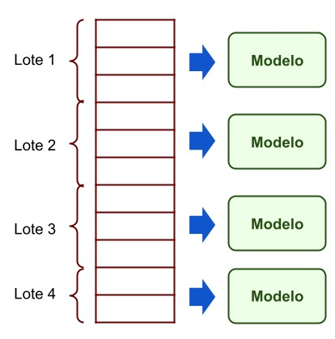

# _DeepHistory_train
Repository that served for the experimentation of models for the thesis work "DeepHistory" by Jose Ysique and Nilton Mercado.

## Enviroment

The **Google Collab** service was used as an experimentation environment due to the lack of computational power of those in charge of this project. 
During the experimentation process, the service of **Google collaborated pro** was hired for the loan of servers with a GPU **Tesla P100-PCIE-16GB** 

## Dataset

The data set used for the training of all models is called **VoxCeleb**.
Both for the download and for the subsequent processing of said data set, the code provided in the repository of Siarohin et al. (2019). Please follow the instruction from https://github.com/AliaksandrSiarohin/video-preprocessing.

It should be noted that due to the fact that some videos of the data set were no longer available, only 18335 training videos and 488 test videos were obtained, from which frames were extracted that vary in quantity between 64 to 1024.

The total time required to process all of these videos was 39 hours and 9 minutes and 19 seconds. In addition, because the Google Colab environment was used to retrain the model, the entire processed dataset had to be hosted in a Google Drive account, which took a total of 29 days.

## Train

Each model corresponds to 1 folder and 1 script found in this repository:
1) Testing for FOMM see ```first-order-model``` (folder and script)
2) Tests for U-Net see ```first-order-model-unet``` (folder and script)
3) Testing for FOMM 6B see ```first-order-model-6c``` (folder and script)
4) Tests for U-Net 3+ see ```first-order-model-unet3``` (folder and script)

## Sampling



Due to the lack of computational power and insufficient time to train the deep learning model with the entire data set, it was decided to implement a sampling method capable of separating the data into **N** groups, which they have an equal number of folders with the processed images.
A special feature of this function is that it selects the folders randomly and without repeating the data; that is, the folders were selected exclusively for each subgroup.
In addition, to ensure the replicability of the subsequent tests, a seed was used in the sampling function.

## Results


